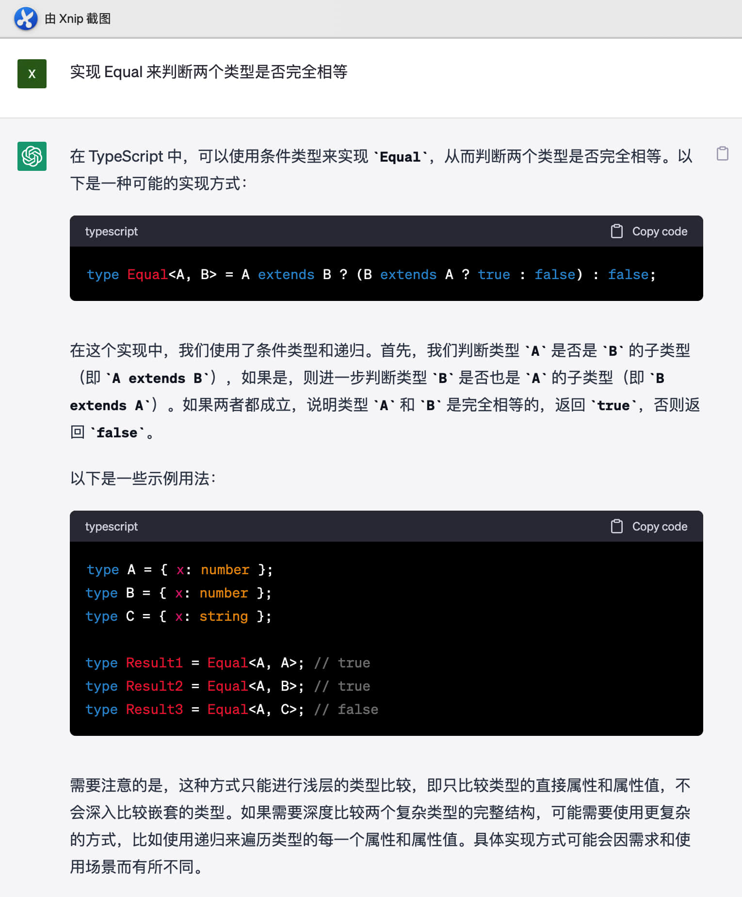
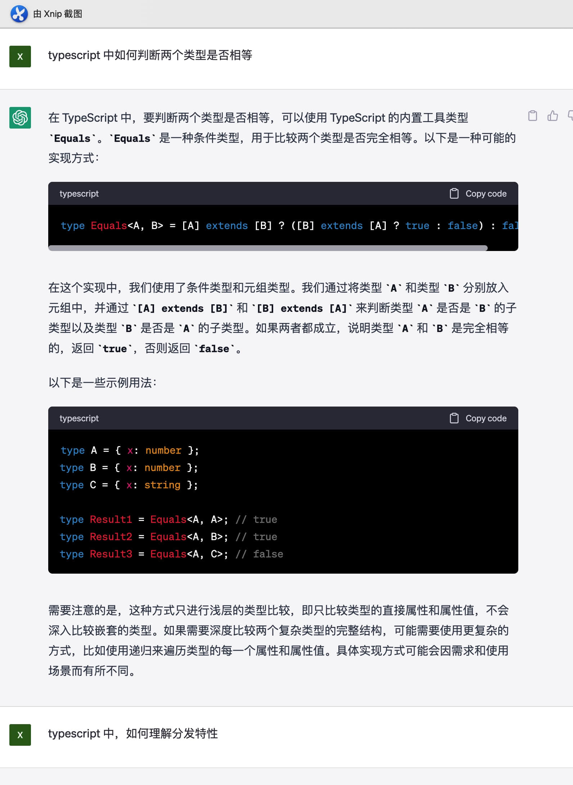
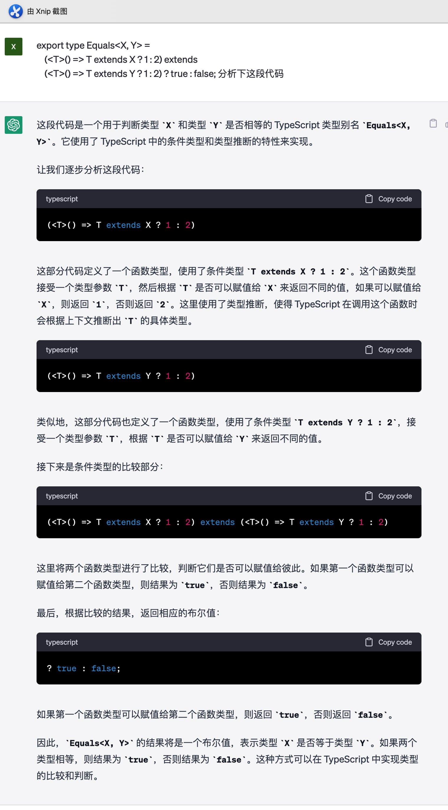

# {{ $frontmatter.title }}

这个可是 TS 高级特性里面最实用也是最隐晦的一条了。

这条特性，chatgpt 都答的不对。

## 简单版

这条答案来自 chatgpt，能够覆盖绝大部分场景。



上述判断也是最直观的写法，但是确实在一些特殊场景下无法正确判断。

常见的就是联合类型，比如： never，可以参考 [isNever 这一题](/medium/1042-isNever.md)。

以及特殊的 any。

其他的联合类型由于[分发特性](https://www.typescriptlang.org/docs/handbook/2/conditional-types.html#distributive-conditional-types)，也会存在判定错误的问题。

```ts
type EqualV1<A, B> = A extends B ? (B extends A ? true : false) : false;

// Case1 = never，因为 分发特性，可以参考 1042-isNever 的解释
type Case1 = EqualV1<never, 1>;

// Case2 = boolean, 主要是因为 any 的特殊性，只要是 any extends xxx ? A : B，返回必定是 A | B，返回必定是
// 在此例中，就是 true | false = boolean
// https://github.com/microsoft/TypeScript/issues/40049
type Case2 = EqualV1<any, 1>;

// Case3 = boolean，分发特性，首先 进行 A extends B 的判断，'a' | 'b' extends 'a' | 'b'，会触发分发
// 'a' extends 'a' | 'b' 是 true，此时进行 B extends A 的判断
// 由于分发特性，此时 A = 'a', B extends A 就是
// 'a' | 'b' extends 'a'，又触发分发， 'a' extends 'a' => true, 'b' extends 'a' => false，此时产生结果 true | false
// 回归上一次 A extends B 的 'b' 的分发
// 'b' extends 'a' | 'b' 是 true，此时进行 B extends A 的判断
// 由于分发特性，此时 A = 'b', B extends A 就是
// 'a' | 'b' extends 'b'，又触发分发， 'a' extends 'b' => false, 'b' extends 'b' => true，此时产生结果 true | false
// 最终进行了 4 次判断，true | false | true | false = boolean。
type Case3 = EqualV1<'a' | 'b', 'a' | 'b'>;
```

还有一点要说的是，**上述 gpt 的解答中，关于浅层判断的说法是错误的，对于 嵌套的对象，元组等等，这个方法也是可以准确判断的。**

比如如下示例：

```ts
// 对于深层次的判断，其实是能够判断出来的，所以也不能完全相信 gpt 啦。
type Case4 = EqualV1<
    {
        a: [
            {
                deep: {
                    a: 1,
                }
            }
        ]
    },
    {
        a: [
            {
                deep: {
                    a: 1,
                }
            }
        ]
    }
>
```

## 升级版

既然对于联合类型，由于分发特性导致上述判断失效，那么去除联合类型的分发特性是否就可以了。以下答案还是来自于 gpt:



在基础版上增加了 `[]` 来消除联合类型的分发特性，基于此，还是上述的例子:

```ts
type EqualV2<A, B> = [A] extends [B] ? ([B] extends [A] ? true : false) : false;

// Case1 = true
type Case1 = EqualV2<never, never>;

// Case2 = true
type Case2 = EqualV2<any, 1>;


// 不会触发分发特性了，[A] extends [B]，消除了分发特性
// Case3 = true
type Case3 = EqualV2<'a' | 'b', 'a' | 'b'>;
```

**同样的，gpt 关于浅层判断的说法是错误的，此处不再举例，有所怀疑的话可以自行尝试，同时这也不是 内置类型。**

可以看到，消除了联合类型的分发特性后，对于 never 和联合类型的判断都是正确的，但是对于 any，还是判定失败。

这是因为 `[any] extends [xx]` 都是 true，具体原因笔者也没查到，算是个特殊情况吧。

除此之外，上述判断，对于属性修饰符，readonly 也无能为力，对于可选是有效的(毕竟一个属性可选后，他的类型中，会追加 undefined 类型)，如下:

```ts
// Case5 = false，一个可选，一个不可选，此时是 false
type Case5 = EqualV1<
    {
        a: 'a'
    },
    {
        a?: 'a'
    }
>

// Case6 = true ，都是可选
type Case6 = EqualV1<
    {
        a?: 'a'
    },
    {
        a?: 'a'
    }
>

// Case7 = true ，对于 readonly 无能为力
type Case7 = EqualV1<
    {
        readonly a: 'a'
    },
    {
        a: 'a'
    }
>
```

## 终极版

最后就是终极版了，这个方案来自 [ts 官方issues讨论](https://github.com/Microsoft/TypeScript/issues/27024#issuecomment-421529650)。

```ts
export type Equals<X, Y> =
    (<T>() => T extends X ? 1 : 2) extends
    (<T>() => T extends Y ? 1 : 2) ? true : false;
```

这个方案可以通过上述所有用例。具体道理，笔者不能强行胡诌，只能说，就这么用吧，官方就建议这么用的。

为了便于辅助记忆，可以看看 gpt 的解释：



有更进一步解读的同学(可能要翻看源码)，欢迎同我联系哈，我也想知道幕后原理 ([联系我](/Contactme.md))。

由于这个判断太过严格，所以对于交叉类型，也存在一些情况：

```ts
// false
type Case1 = Equals<
    {
        a: 'a',
        b: 'b'
    },
    {
        a: 'a'
    } & {
        b: 'b'
    }
>

type Merge<T> = {
    [P in keyof T]: T[P]
}

// Case2 = true
type Case2 = Equals<
    {
        a: 'a',
        b: 'b'
    },
    Merge<{
        a: 'a'
    } & {
        b: 'b'
    }>
>
```

必须 merge 后，交叉类型才能判定为相等。

## 总结

本章对判断两个类型相等做了详细的解答，从显而易见的基础版，到消除了分发特性的升级版，到最终官方的终极版，均进行了讨论，列举了其不能覆盖的场景。

基于此，虽然所有的场景都可以通过终极版覆盖，但是对于一些简单的判断，比如常见的字面量类型，1 | '1' 这样的普通判断，简单版即可。而涉及到联合类型 or never 时，就必须要使用升级版了，对于修饰符的场景，就必须使用 终极版了。

了解了这个能力，很多题目，[isNever](/medium/1042-isNever.md), [949-AnyOf](/medium/949-AnyOf.md)、[527-AppendToObject](/medium/527-AppendToObject.md) 等题目中的判断就可以用到了。
